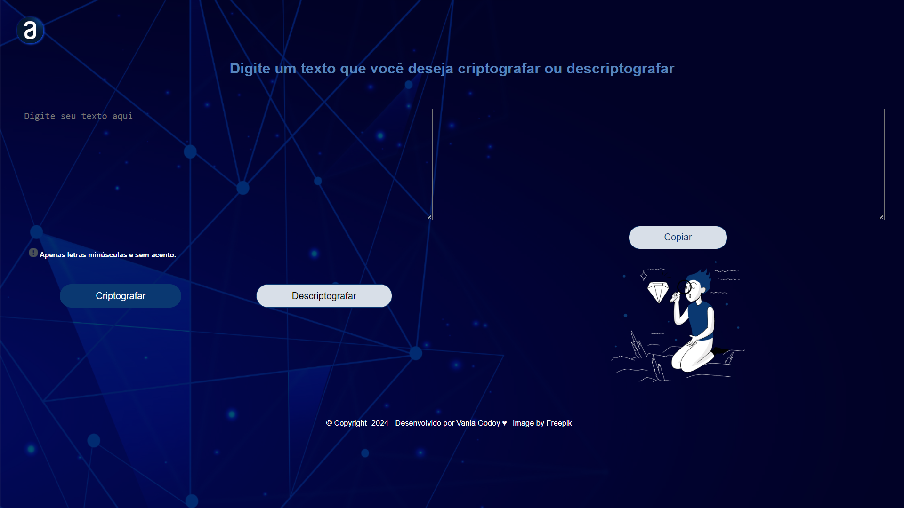

# Encriptador

O Encriptador é uma aplicação web simples desenvolvida como parte da trilha de formação da Alura. Ele permite aos usuários criptografar ou descriptografar mensagens de texto usando um conjunto específico de substituições de letras.

## Funcionalidades

- **Criptografar texto:** Insira o texto na área de entrada e clique no botão "Criptografar" para converter o texto usando um conjunto predefinido de substituições de letras.
- **Descriptografar texto:** Insira o texto na área de entrada e clique no botão "Descriptografar" para reverter a criptografia.
- **Copiar texto:** Após a criptografia ou descriptografia, clique no botão "Copiar" para copiar o texto resultante para a área de transferência.

## Como usar

1. Abra o arquivo `index.html` em um navegador da web.
2. Insira o texto na área de entrada.
3. Clique no botão "Criptografar" ou "Descriptografar", conforme necessário.
4. Clique no botão "Copiar" para copiar o texto resultante para a área de transferência.

## Tecnologias Utilizadas

- HTML
- CSS
- JavaScript

## Recursos

- [Repositório Git](https://github.com/VaniaGodoy/challengeAlura): Link para o repositório do Git onde este projeto está hospedado.
- [Vercel](https://challenge-alura-tau.vercel.app/): Link para a implantação do projeto no Vercel.

## Autor

Desenvolvido por [Vania Godoy](https://github.com/VaniaGodoy) - 2024
